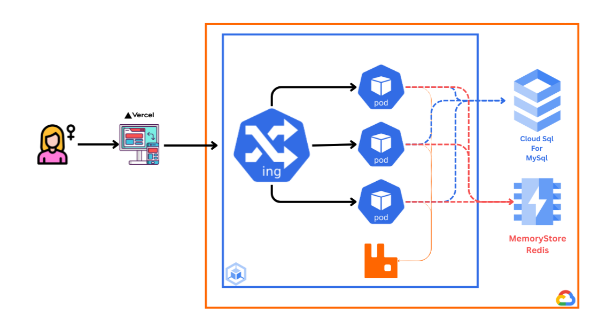

# PinkLifeLine
<p align='center'>
    
</p>

The site is live at http://www.pinklifeline.xyz.
## Project  Overview
PinkLifeline is a comprehensive platform designed to support breast cancer patients and their families. The platform enables users to book appointments with specialized healthcare providers, compare treatment costs, and access expert-verified educational content. It also includes self-assessment tools, home-based chemotherapy services, advanced medical report management, and a community forum for emotional and mental support.

## System Architecture Diagram
<p align='center'>
    
</p>

## Table of Contents
- [Backend Technologies](#backend-tech)
- [Frontend Technologies](#frontend-tech)
- [Deployment Services](#deployment-services)
- [Prerequisites](#prerequisites)
- [Installation](#installation)
- [Testing](#testing)
- [Continuous Integration and Deployment](#continuous-integration-and-deployment)
- [Deployment](#Deployment)
- [Contributing](#contributing)
- [License](#license)

## Backend Tech

| **Category**        | **Technology**                                                                        |
|---------------------|---------------------------------------------------------------------------------------|
| Main Backend        | Spring Boot 3                                                                         |
| Security            | Spring Security, Spring OAuth Resource Server, Google Cloud Secret Manager            |
| Database and ORM    | MySQL, Spring Data JPA, Flyway Migrations                                             |
| Caching             | Spring Data Redis                                                                     |
| Mail                | Spring Boot Starter Mail                                                              |
| Tests               | JUnit, Testcontainers                                                                 |
| Notifications       | Web Push    

## Frontend Tech

| **Category**                    | **Technology**                                                                            |
|---------------------------------|-------------------------------------------------------------------------------------------|
| Main Frontend                   | Next.js                                                                                   |
| UI Components and Design        | @mui/material, shadcn-components, primereact, react-select                               |
| Animation and Motion Libraries  | framer-motion, lottie-react                                                               |
| Machine Learning and AI         | @google/generative-ai, @tensorflow/tfjs, @tensorflow-models/toxicity, tesseract.js       |
| Video and Multimedia            | @stream-io/video-react-sdk                                                                |
| Screenshot and PDF Management   | html2canvas, jspdf (PDF generation)                                                       |
| GeoLocation                     | leaflet, react-leaflet, h3-js, react-geolocated                                           |
| Text Editing                    | jodit-react, @emoji-mart                                                                  |

## Deployment Services

| **Component**         | **Technology/Service**                    |
|-----------------------|-------------------------------------------|
| Database              | Cloud SQL                                 |
| Redis                 | Cloud Memory Store Redis                  |
| Backend               | Google Kubernetes Engine                  |
| Frontend              | Vercel                                    |
| Domain                | Namecheap                                 |
| SSL Certificate       | Google Kubernetes Engine                  |
| Monitoring            | Google Cloud Monitoring                   |

## Prerequisites

Before getting started, ensure you have the following installed:
- Node.js
- Docker
- Kubectl (for deployment)
- terraform (for deployment)
- gcloud (for deployment)

## Installation

To install the project locally, follow these steps:

1. Clone the repository:

```bash
git clone https://github.com/Sadatul/Pinklifeline
cd Pinklifeline
```
2. Create a .env file from .evn.example
3. Run the following docker command
```bash
docker compose up --build -d
```
4. Create a .env file inside frontend folder based on frontend/.env.example
5. Run the following commands to start the frontend
```bash
cd frontend
npm i
npm run build
npm start
```

## Testing

This project uses [JUnit](https://junit.org/junit5/) with [TestContainers](https://testcontainers.com/) for running tests. TestContainers allows us to run integration test without need to setup a separate environment. Please make sure you have docker deamon running, otherwise testcontainer won't be able to function properly.

To run the tests, use the following command:

```bash
cd backend/pinklifeline
./mvnw test
```

## GitHub Actions
This project utilizes [GitHub Actions](https://github.com/features/actions) for automating the CI/CD pipeline. The workflow files are located in the `.github/workflows` directory. We have two workflow here.

1. **Test & Build:**
    
    * Test are executed using maven to verify correctness of the code. A branch rule prevents us from pushing to dev branch if the tests fail
    * Builds and pushes a dev docker image to docker hub.
2. **Production Build and Deploy** 
    * Runs when a release is created
    * It creates a new image and pushes it to docker hub to be deployed on kubernetes.

## Deployment
We are using terraform to provision our entire infrastructure. You can find the iaac related code inside the ```deployment/iaac``` directory. After provisioning the infrastructure we are using kubernetes to deploy our backend. You can find the deployment files ```deployment/iaac/k8s```
**Please ignore the deployment/k8s folder**
## Monitoring
We are using [Google Cloud Monitoring](https://cloud.google.com/monitoring) to monitor our backend.

## Challenges
* As we are using websockets, horizontal scalibiliy was a big challenge for us. We used rabbitmq and stored our queues inside rabbitmq which allowed us to make our system horizontally scalalble.
* Another challenge we faced near by search. We used H3 geo hash to do fast nearByUser search.

## Contributing

Contributions are welcome! If you find any issues or have suggestions for improvement, please open an issue or submit a pull request.

Here is a comprehensive [walkthrough](https://youtu.be/HkNbTAEvXt0?si=LoSi6e3R3GhJdAVX) of the project in Bangla: **Please note the since this video we have pushed a new updated UI. This video showcases all the functionalities but the latest release has much better UI and user experience**

## License

This project is licensed under the [MIT License](LICENSE).

